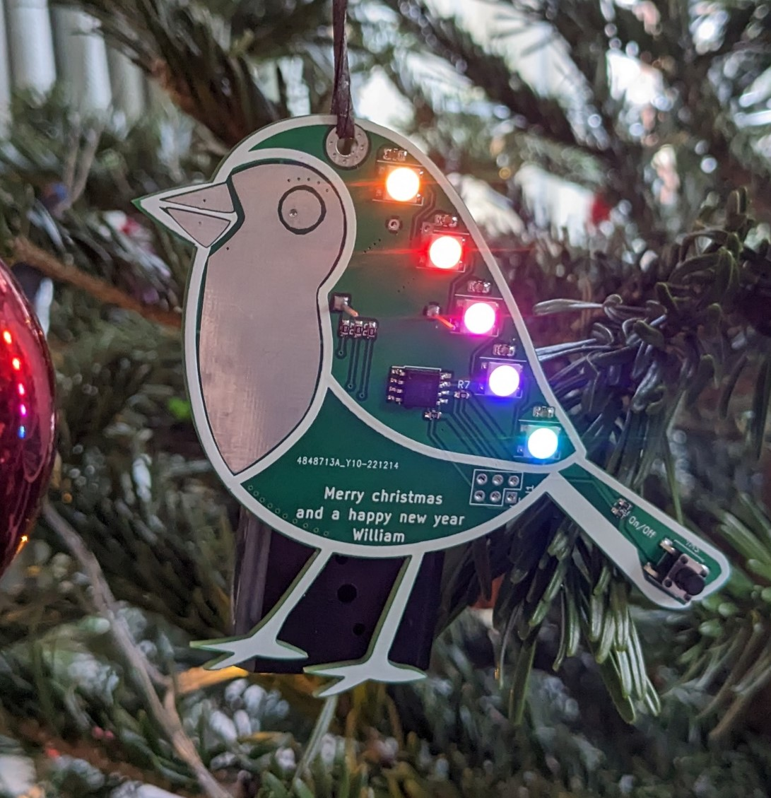
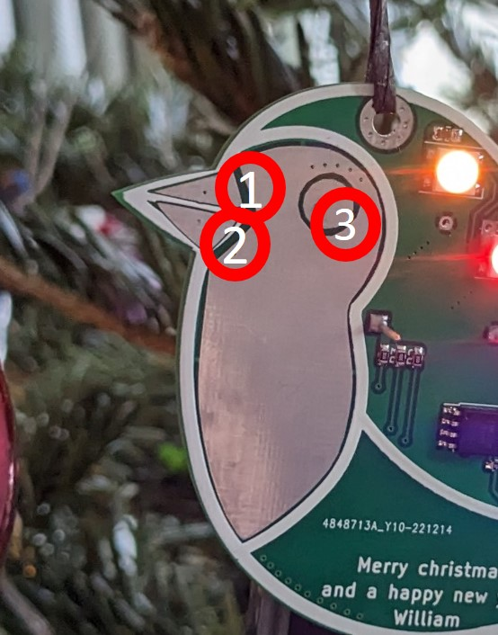

# Robin PCB

Over Christmas 2022 I made 20 Christmas themed Robin PCBs. Powered by an Attiny85, each PCB had 5 neopixels so show pretty patterns and a buzzer so it can play Christmas music. They have 2 AA batteries and an off switch meaning they should last longer than last years!

## Robin Instructions

Turn the Robin on or off with the button located on the tail. Every time you turn it on it rotates between 2 different patterns. To make it play music, press firmly on one of the spots marked below. You may have to have slightly sweaty hands for it to work :)

Instead of having 3 buttons for the Christmas songs, I connected 3 of the gpios from the microcontroller to 3 exposed copper pads on the pcb (the eye and the 2 beaks). These are pulled high by a 200k resistor but if you press between the copper pad and ground as shown in the diagram below, you pull the voltage down as current flows through the moisture on your finger. The microcontroller detects that the voltage is reduced so plays a song.

## The assembly process

* I first used a stencil to apply solder paste to the robin
* I then used tweesers to place all the parts onto the board
* I used a hot plate to reflow solder all the components
* I used a soldering iron to attach both the battery holder (through hole) and the buzzer (on the opposite side to the rest of the components)
* I used an arduino to program the microcontroller via spi